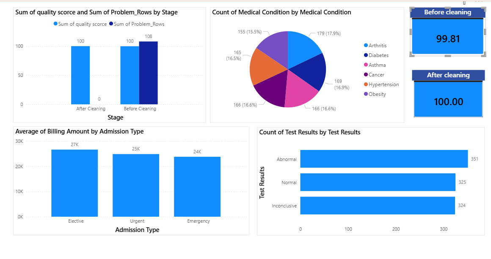

# Healthcare Data Quality Assessment
A comprehensive data quality assessment project applying the **DAMA-DMBOK** data quality framework to a healthcare dataset, using **SQL**, **Python**, and **Power BI**. 

## Project Overview
This project evaluates and improves the quality of a healthcare dataset by applying the **7 DAMA-DMBOK Data Quality Dimensions**:

1. **Accuracy** — Are the values correct and valid?
2. **Completeness** — Are there missing values?
3. **Consistency** — Is formatting and terminology consistent?
4. **Relevance** — Are all columns relevant to the analysis?
5. **Timeliness** — Is the data up to date?
6. **Uniqueness** — Are there duplicate records?
7. **Validity** — Does the data conform to expected formats and rules?

## Tools Used

- **SQL (MySQL Workbench)** — data profiling, cleaning, and quality scoring
- **Python (Jupyter Notebook / Pandas)** — data quality assessment functions and automated cleaning
- **Power BI** — interactive dashboard for before/after comparison

## Dataset

**Source:** [Healthcare Dataset — Kaggle](https://www.kaggle.com/datasets/prasad22/healthcare-dataset)

Contains patient records including: Name, Age, Gender, Blood Type, Medical Condition, Date of Admission, Doctor, Hospital, Insurance Provider, Billing Amount, Room Number, Admission Type, Discharge Date, Medication, and Test Results.

## Methodology

1. **Data Profiling** — Assessed all 7 dimensions on the raw dataset using SQL and Python
2. **Issue Identification** — Detected invalid ages, negative billing amounts, inconsistent name casing, invalid blood types/test results, and duplicate records
3. **Data Cleaning** — Removed invalid rows, standardized text formatting, and eliminated duplicates
4. **Re-Assessment** — Re-ran the same quality checks on the cleaned dataset
5. **Dashboard** — Built a Power BI dashboard visualizing the before/after comparison

## Results

| Metric | Before Cleaning | After Cleaning |
|---|---|---|
| Total Rows | 55,500 | 54,860 |
| Problem Rows | 108 | 0 |
| **Data Quality Score** | **99.81%** | **100.00%** |

## Repository Contents

| File | Description |
|---|---|
| `data_quality_assessment.ipynb` | Python notebook — full data quality assessment & cleaning workflow |
| `data_quality_assessment.sql` | SQL scripts covering all 7 dimensions in MySQL |
| `healthcare_cleaned.csv` | Final cleaned dataset |
| `quality_score_summary.csv` | Before/after quality score summary used in Power BI |
| `dashboard_screenshot.png` | Power BI dashboard preview |

## Dashboard Preview

The dashboard includes:
- Before/After Quality Score comparison cards
- Quality Score & Problem Rows by Stage (bar chart)
- Medical Condition distribution (pie chart)
- Test Results distribution (bar chart)
- Average Billing Amount by Admission Type

## Relevance to Data Governance
**This project demonstrates practical application of data governance principles aligned with **DAMA-DMBOK** and **NDMO** frameworks, including data profiling, quality dimension assessment, and documentation — key skills for a **Certified Data Management Professional (CDMP)**
